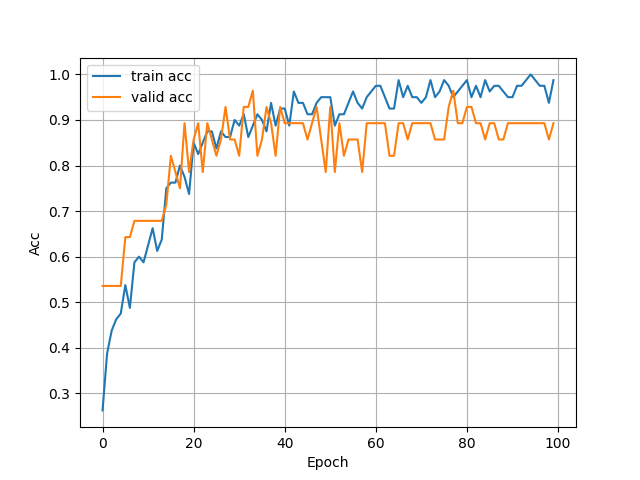

## HRM project
### 1. Swallow-level model

### 2. Study-level model

* train/valid Loss
* 
    

 
* train/valid Accuracy (**1.0 / 0.892**)
* 
    

---
>請忽略以下
### 1. Dataset preparation

> !python transfer.py

1. mkdir data (建立"data" folder)
  
2. 將醫院提供的資料放到 **data folder**

3. 執行transfer.py，轉後過後的所有csv file 會出現在**train folder**
  

### 2. Show 10 wet swallows

> !python show.py

* 原圖(醫院提供)
    

 
* 利用python畫出10次swallow
    

### 3. Get 10 wet swallows values
